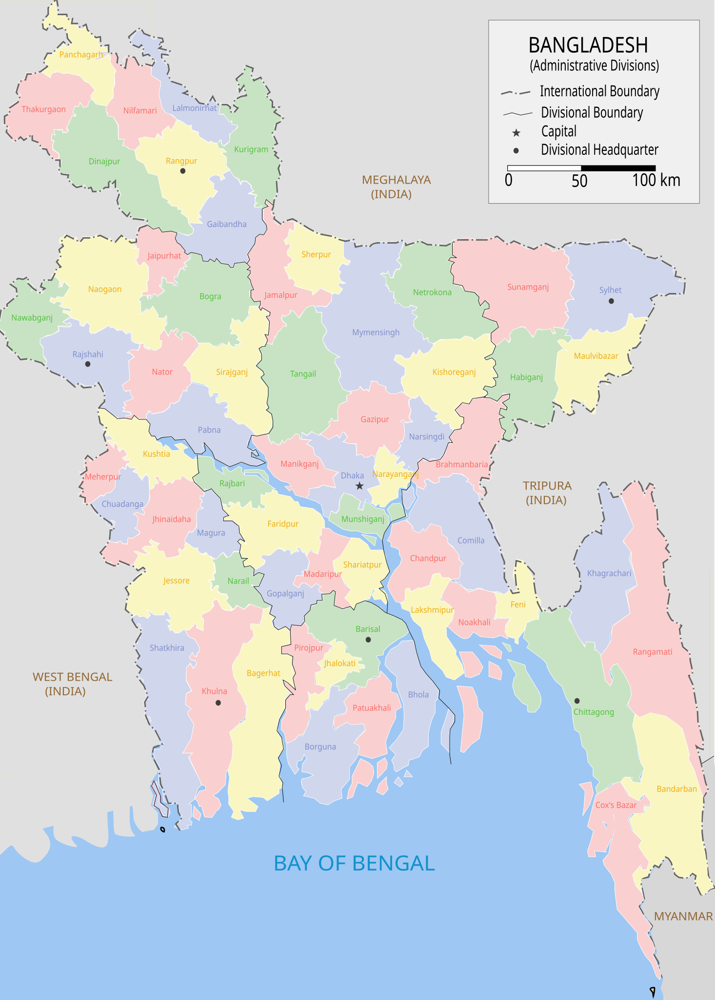
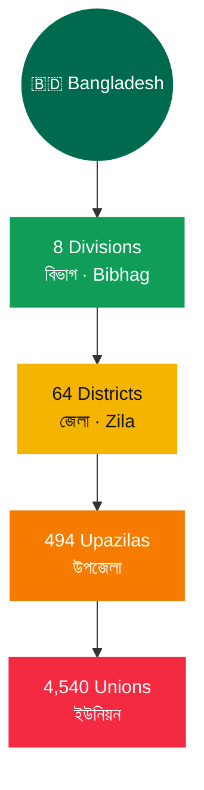
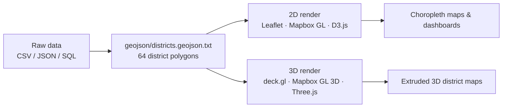

<div align="center">

# 🇧🇩 Bangladesh Geocode

### The complete, open-source administrative & geographic dataset for Bangladesh

Division → District → Upazila → Union, with bilingual names, coordinates, and district-level GeoJSON boundaries — ready for address forms, dashboards, and real 2D/3D map rendering.

[](https://opensource.org/licenses/MIT)
[](https://github.com/bayeziddev/Bangladesh-geocode/stargazers)
[](https://github.com/bayeziddev/Bangladesh-geocode/network/members)
[](https://github.com/bayeziddev/Bangladesh-geocode/issues)
[](https://github.com/bayeziddev/Bangladesh-geocode/commits/main)
[](#-contributing)
[](https://github.com/bayeziddev)

**[Dataset Overview](#-dataset-overview) · [2D / 3D Rendering Guide](#-2d--3d-geo-rendering) · [Quick Start](#-quick-start) · [Report an Issue](https://github.com/bayeziddev/Bangladesh-geocode/issues)**

</div>

<br/>

<p align="center">
  
</p>

---

## 📖 Table of Contents

- [Overview](#-overview)
- [Dataset Overview](#-dataset-overview)
- [Administrative Hierarchy](#-administrative-hierarchy)
- [2D / 3D Geo-Rendering](#-2d--3d-geo-rendering)
- [Repository Structure](#-repository-structure)
- [Data Schema](#-data-schema)
- [Quick Start](#-quick-start)
- [Usage Examples](#-usage-examples)
- [Real-World Use Cases](#-real-world-use-cases)
- [FAQ](#-faq)
- [Contributing](#-contributing)
- [Support This Project](#-support-this-project)
- [Author](#-author)
- [License](#-license)

---

## 🧭 Overview

**Bangladesh Geocode** is a free, MIT-licensed dataset covering the full administrative structure of Bangladesh — from **Division** all the way down to **Union** — plus **district boundary polygons** and a **vector map**, so you can go from raw location data to a rendered map with almost no setup.

| | |
|---|---|
| 🏛️ **4-level hierarchy** | Division → District → Upazila → Union, fully linked by ID |
| 🌐 **Bilingual** | English *and* বাংলা (Bengali) names for every single entry |
| 📍 **Real coordinates** | Latitude / longitude for all 64 districts |
| 🗺️ **Boundary polygons** | GeoJSON `MultiPolygon` geometry for every district — not just names |
| 🎨 **Vector map included** | Ready-to-use administrative SVG map of Bangladesh |
| 📦 **5 formats, zero lock-in** | CSV · JSON · SQL · PHP · XML |

---

## 📊 Dataset Overview

| Level | বাংলা | Count | Formats | Key Fields |
|---|---|---:|---|---|
| **Division** | বিভাগ (Bibhag) | **8** | CSV · JSON · SQL · PHP · XML | `id`, `name`, `bn_name`, `url` |
| **District** | জেলা (Zila) | **64** | CSV · JSON · SQL · PHP · XML | `id`, `division_id`, `name`, `bn_name`, `lat`, `lon`, `url` |
| **Upazila** | উপজেলা | **494** | CSV · JSON · SQL · PHP · XML | `id`, `district_id`, `name`, `bn_name`, `url` |
| **Union** | ইউনিয়ন | **4,540** | CSV · JSON · SQL · PHP · XML | `id`, `upazila_id`, `name`, `bn_name`, `url` |
| **District boundaries** | — | 64 polygons | GeoJSON | `ADM1_EN`, `ADM2_EN`, `MultiPolygon` |
| **Admin map** | — | 1 vector file | SVG | Country-wide, division-level |

> **5,106 location records** in total, every one of them traceable back to its parent through a foreign key.

---

## 🗺️ Administrative Hierarchy



Every child record carries its parent's ID (`division_id`, `district_id`, `upazila_id`), so the whole hierarchy is a single join away in any language.

---

## 🌐 2D / 3D Geo-Rendering

This repository doesn't just list place names — `geojson/districts.geojson.txt` ships real **district boundary polygons** (64 `MultiPolygon` features), so you can render an actual map, not a text diagram.



**2D — Leaflet.js choropleth**

```js
fetch('geojson/districts.geojson.txt')
  .then(res => res.json())
  .then(geojson => {
    L.geoJSON(geojson, {
      style: () => ({ color: '#006A4E', weight: 1, fillColor: '#0F9D58', fillOpacity: 0.5 }),
      onEachFeature: (feature, layer) =>
        layer.bindPopup(`${feature.properties.ADM2_EN}, ${feature.properties.ADM1_EN}`)
    }).addTo(map);
  });
```

**3D — deck.gl extruded polygons**

```js
import { GeoJsonLayer } from '@deck.gl/layers';

new GeoJsonLayer({
  id: 'bd-districts-3d',
  data: 'geojson/districts.geojson.txt',
  extruded: true,
  getElevation: f => f.properties.yourMetric ?? 20000, // swap in population, sales, etc.
  getFillColor: [15, 157, 88, 180],
  getLineColor: [0, 106, 78],
  pickable: true
});
```

Feed `getElevation` with any per-district metric — population, order volume, delivery time — and you get an instant 3D choropleth of Bangladesh. The same GeoJSON also drops straight into Mapbox GL JS, Turf.js, QGIS, or any standard GIS tool.

> **Note:** `geojson/districts.geojson` currently holds a single sample feature (Bagerhat); the complete 64-district boundary set lives in `geojson/districts.geojson.txt`.

---

## 📁 Repository Structure

```
Bangladesh-geocode/
├── divisions/                 8 divisions        (CSV · JSON · SQL · PHP · XML)
├── districts/                 64 districts       (CSV · JSON · SQL · PHP · XML)
├── upazilas/                  494 upazilas       (CSV · JSON · SQL · PHP · XML)
├── unions/                    4,540 unions       (CSV · JSON · SQL · PHP · XML)
├── geojson/
│   ├── districts.geojson.txt  64 district boundary polygons (full set)
│   └── districts.geojson      1-feature sample
├── img/
│   └── BD_Map_admin.svg       administrative vector map
└── README.md
```

---

## 🧬 Data Schema

<details>
<summary><strong>divisions</strong> — 4 columns</summary>

| Column | Type | Example |
|---|---|---|
| `id` | int | `6` |
| `name` | varchar | `Dhaka` |
| `bn_name` | varchar | `ঢাকা` |
| `url` | varchar | `www.dhakadiv.gov.bd` |

</details>

<details>
<summary><strong>districts</strong> — 7 columns</summary>

| Column | Type | Example |
|---|---|---|
| `id` | int | `1` |
| `division_id` | int → `divisions.id` | `1` |
| `name` | varchar | `Cumilla` |
| `bn_name` | varchar | `কুমিল্লা` |
| `lat` | decimal | `23.4682747` |
| `lon` | decimal | `91.1788135` |
| `url` | varchar | `www.comilla.gov.bd` |

</details>

<details>
<summary><strong>upazilas</strong> — 5 columns</summary>

| Column | Type | Example |
|---|---|---|
| `id` | int | `1` |
| `district_id` | int → `districts.id` | `1` |
| `name` | varchar | `Debidwar` |
| `bn_name` | varchar | `দেবিদ্বার` |
| `url` | varchar | `debidwar.comilla.gov.bd` |

</details>

<details>
<summary><strong>unions</strong> — 5 columns</summary>

| Column | Type | Example |
|---|---|---|
| `id` | int | `1` |
| `upazila_id` | int → `upazilas.id` | `1` |
| `name` | varchar | `Subil` |
| `bn_name` | varchar | `সুবিল` |
| `url` | varchar | `subilup.comilla.gov.bd` |

</details>

---

## 🚀 Quick Start

### SQL

```bash
git clone https://github.com/bayeziddev/Bangladesh-geocode.git
cd Bangladesh-geocode

mysql -u username -p your_database < divisions/divisions.sql
mysql -u username -p your_database < districts/districts.sql
mysql -u username -p your_database < upazilas/upazilas.sql
mysql -u username -p your_database < unions/unions.sql
```

### JSON (Node.js / browser)

```js
const districts = require('./districts/districts.json');

const dhakaDistricts = districts.filter(d => d.division_id === '6');
```

### PHP

```php
require 'divisions/divisions.php';
require 'districts/districts.php';

$dhakaDistricts = array_filter($districts, fn($d) => $d['division_id'] === '1');
```

### CSV (Python / pandas)

```python
import pandas as pd

districts = pd.read_csv(
    'districts/districts.csv', header=None,
    names=['id', 'division_id', 'name', 'bn_name', 'lat', 'lon', 'url']
)
```

---

## 💡 Usage Examples

**Cascading location dropdowns — Division → District → Upazila → Union**

```js
divisionSelect.addEventListener('change', e => {
  const districts = allDistricts.filter(d => d.division_id === e.target.value);
  populateOptions(districtSelect, districts);
});
```

**Nearest district by GPS coordinates**

```js
function nearestDistrict(lat, lon, districts) {
  return districts.reduce((closest, d) =>
    haversine(lat, lon, d.lat, d.lon) < haversine(lat, lon, closest.lat, closest.lon) ? d : closest
  );
}
```

---

## 🎯 Real-World Use Cases

- 🛒 **E-commerce checkout** — cascading address forms; pair with your own zone table (e.g. *inside Dhaka* vs *outside Dhaka*) to calculate shipping cost and delivery time
- 🗺️ **Interactive maps** — choropleth dashboards, delivery-coverage maps, store locators
- 🧊 **3D data visualization** — extrude districts by sales, population, or any metric for ops and investor dashboards
- 📮 **Address validation** — enforce valid Division / District / Upazila / Union combinations at signup or checkout
- 📊 **Regional analytics** — join your own business data on `division_id` / `district_id` for territory-level breakdowns

---

## ❓ FAQ

**Is this free to use?**
Yes — MIT licensed, free for personal and commercial projects.

**How accurate is the data?**
Sourced from official Bangladesh government administrative records, with district-level names cross-checked against divisional government websites.

**Can I use the GeoJSON boundaries in [my map library]?**
Yes — it's standard `FeatureCollection` / `MultiPolygon` GeoJSON, so it works with Leaflet, Mapbox GL JS, deck.gl, D3.js, Turf.js, QGIS, and most GIS tooling out of the box.

**Does this include Thana or postal code data?**
Not currently — the hierarchy stops at Union. Contributions adding postal codes or city-corporation thana boundaries are welcome.

**Can I contribute?**
Absolutely — fork the repo and open a pull request with new or corrected data.

---

## 🤝 Contributing

Contributions, corrections, and new formats are always welcome.

1. Fork the repository
2. Create a branch — `git checkout -b add-postal-codes`
3. Commit your changes
4. Open a pull request

Found incorrect data? [Open an issue](https://github.com/bayeziddev/Bangladesh-geocode/issues) and mention the source you're comparing against.

---

## 💚 Support This Project

If this dataset saved you time, consider supporting its upkeep:

| Method | Details |
|---|---|
| PayPal | [paypal.me/connectwithbayezid](https://www.paypal.me/connectwithbayezid) |
| bKash | `01791527854` |
| Nagad | `01519601517` |
| Rocket | `01519601517` |

---

## 👤 Author

**Sayad Md Bayezid Hosan**

[Portfolio](https://sayadbayezid.com) · [Verified Profiles](https://sayadbayezid.com/verified-profiles/) · [GitHub](https://github.com/bayeziddev)

---

## 📄 License

Released under the **MIT License** — free to use, modify, and distribute, including commercially.

> Tip: add a `LICENSE` file to the repository root so GitHub automatically shows the license badge in the sidebar.

---

<div align="center">

**Made with 🩷 for Bangladesh developers, by [@bayeziddev](https://github.com/bayeziddev)**

If this project helped you, **star the repo ⭐** — it helps others find it too.

</div>